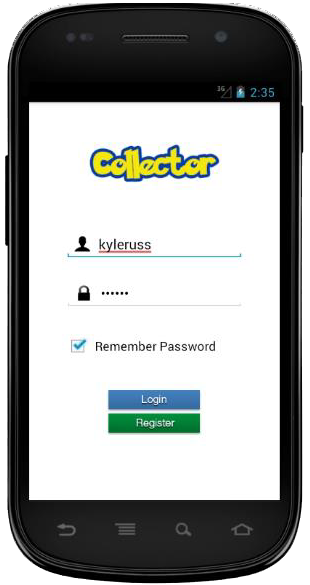

# CollectorApp

[](https://forthebadge.com)

<p align="center">
  
</p>

## About
Collector is a mobile application that allows users to collect [Pokemon](https://en.wikipedia.org/wiki/Pok%C3%A9mon) cards, manage and trade them with their friends  
Users can create an account and sign-in with the app where they can access their cards, decks and friends  
Users start with 10 random cards to begin their collection and each day a user signs in they are granted 2 new random cards  
A user can trade any of their cards with their friends and grow their collection or create custom decks with their favourite cards to show off to friends. 
For a full user-guide and technical write up see the [Documentation](Documentation.pdf)

### Features
- Collect cards from the popular Pokemon game
- Create card decks and add cards to them
- User account registration
- Account sign-in
- Add friends to trade and show off cards with
- Manage account settings

## Getting started

### Prerequisites
- JDK 1.8+
- NetBeans 8.2 + EE
- Android APIs 18-21
- Glassfish 4.1
- MySQL 5.7+
- MySQL Connector/J
- Hibernate4
- Apache 
- PHP 

### Installation
- Clone the CollectorApp repository

```
git clone https://github.com/kyleruss/collector-app.git
```

- Import the CollectorApp enterprise application `collector-server` into NetBeans
There should be two components: `collector-server-war` and `collector-server-ejb`

- Connect to your MySQL server and create the `collector` database 

```
mysql -u root -p
CREATE DATABASE collector;
exit
```

- Run the database migration script in `install/migration.sql`
```
mysql -u root -p collector < migration.sql
```

##### Running the scraper
- Copy the `scraper` directory into you apache web root directory and start your apache server 
- Run the `scraper.php` script and copy the images downloaded into `collector-server/collector-server-war/web/images`
- Connect to your MySQL server and run code in `typesscript.sql` then `importscript.sql`

##### Setting up the Glassfish server
- Start your glassfish server and go to the admin console (`localhost:DASTPORT`)
- Create a JDBC connection pool with a `javax.sql.DataSource` resource type and  
driver class name `com.mysql.jdbc.jdbc2.optional.MysqlDataSource`
- Set your database username, password, port etc. in the additional properties
- Create a JDBC resource called `jdbc/mysql` using the connection pool that was created
- Deploy both the `ejb` and `war` components to the Glassfish server in NetBeans  

## License
CollectorApp is available under the MIT License  
See [LICENSE](LICENSE.md) for more details
